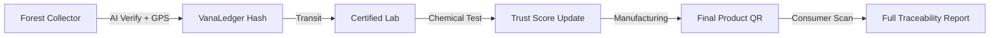

# 🌿 VanaSetu: Ayurvedic Supply Chain Traceability

> **Restoring Trust in Ancient Wisdom through Modern Technology.**

VanaSetu (Vana - *Forest*, Setu - *Bridge*) is a state-of-the-art, end-to-end traceability platform designed to bridge the transparency gap in India's Ayurvedic supply chain. By integrating **AI-driven identification**, **Blockchain immutability**, and **Real-time IoT data**, VanaSetu ensures that every herb used in Ayurvedic formulations is authentic, pure, and ethically sourced.

---

## 🏗️ Core Pillars

### 1. 🛡️ The Blockchain & Security Layer (The "VanaLedger")
At the heart of VanaSetu is a sophisticated security architecture that prevents data tampering and "Trust-Dilution."
*   **SHA-256 Cryptographic Hashing:** Every critical event (Collection, Lab Verification, Manufacturing) is passed through a SHA-256 algorithm. This creates a unique "Digital Fingerprint" of the data payload.
*   **Immutable Anchoring:** These hashes are anchored to a permissioned blockchain ledger (**Hyperledger Fabric** architecture). Once a record is committed, it cannot be deleted or altered by any participant.
*   **Tamper-Evidence:** Any attempt to modify the database records (like changing the weight or purity after the fact) will cause a "Hash Mismatch," instantly alerting all stakeholders in the chain.
*   **Double-Spending Prevention:** The system tracks the "Mass Balance" of every batch. A manufacturer cannot sell more "Verified" units than the physical weight of raw material received from the lab.

### 2. 🧠 AI-Powered Verification
*   **Edge AI (TFLite):** The Collector App uses a MobileNetV2-based computer vision model to verify herbal species at the forest floor, preventing misidentification or accidental harvest of toxic look-alikes.
*   **Confidence Scoring:** Only collections with a high AI confidence score (typically >85%) are passed through the "Green Channel."

### 3. 🔬 Clinical Accountability
*   **Digital Handshakes:** A physical-to-digital bridge where Labs re-verify the collector's claims (Weight, Purity, pH, Heavy Metals).
*   **Trust Score Algorithm:** A dynamic 100-point score calculated from AI confidence, lab purity, weight consistency, and contamination tests.

---


*   **LAB REPORT**


--


## 📱 Project Components

| Component | Technology | Role |
| :--- | :--- | :--- |
| **Android App** | Kotlin, TFLite, Retrofit | Edge-collection, GPS-tagging, AI-verification. |
| **Backend** | FastAPI, PostgreSQL, SQLAlchemy | The API Engine & Mock Blockchain Controller. |
| **Dashboard** | React, Vite, Framer Motion | B2B interface for Labs and Manufacturers. |
| **Consumer Portal**| Leaflet.js, QR Integration | The "Last Mile" transparency interface for users. |

---

## 🛠️ Installation & Setup

### 🚀 Automatic Setup
To install all dependencies (Python and Node.js) in one go, run the following in PowerShell:
```powershell
./setup.ps1
```

### 🐍 Backend Setup (FastAPI)
```bash
cd backend
pip install -r requirements.txt
uvicorn main:app --reload
```

### ⚛️ Frontend Setup (React)
```bash
cd frontend
npm install
npm run dev
```

### 🤖 Android Setup (Kotlin)
1. Open the `/android` folder in **Android Studio**.
2. Ensure you have the `mobilenet_v2_5_classes.tflite` model in the `assets/` folder.
3. Update the `BASE_URL` in `MainActivity.kt` to point to your backend (or your **Ngrok** URL for mobile testing).

---

## 🛤️ The VanaSetu Journey



---

## ⚖️ License
This project is developed for the **VanaSetu Sustainability Initiative**. All rights reserved.
